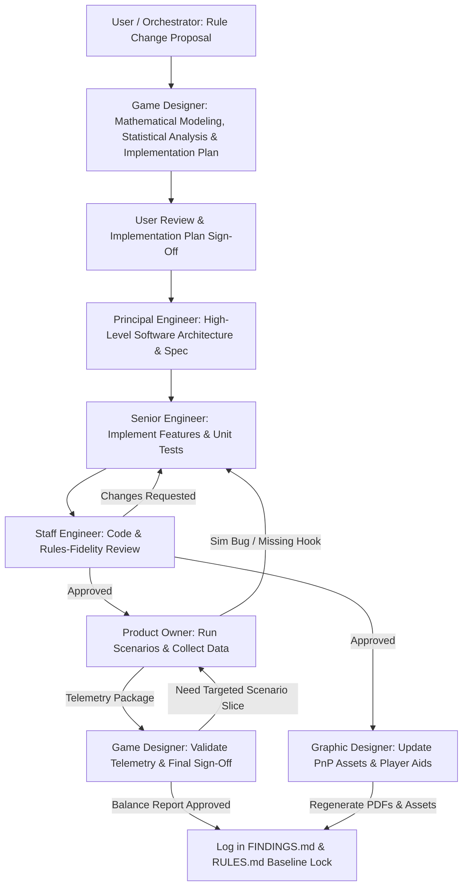

# Rogue Agent — Stress-Test & Implementation Plan

Canonical workspace roadmap for building and running Monte Carlo simulations against [RULES.md](./RULES.md).

## Current Status
- [x] **Rules Draft `v0.37.0`** captured in [RULES.md](./RULES.md)
- [x] **Multi-Agent SDLC Pipeline** defined in Section 2 below
- [ ] **Phase 44 (exploration): Red Rebalance — $2 Ransom, Block 2 Red, Red Choice Face**
  - [x] *Pre-SDLC Game Designer Modeling:* proposal = $2 per unblocked Red cube; Red 1-pip face `Block 2 Red`; one Red `+$2` face becomes `+$1 / +1 🔬`; Blue, Green and ★ variants unchanged. Sim levers `red_ransom_per_cube` and `red_die_profile` (defaults = v0.35). Sweep `scripts/run_v360_red_rebalance_sweep.py` (1,500 games per pod). Results: `FINDINGS.md` §31.
  - [x] *User decision on sweep results:* not adopted; superseded by Phase 45 (no `RULES.md` change).
- [ ] **Phase 47: Reference Bot — Mixed Policy & Fast Search Bot (sim tooling, no rules change)**
  - [x] *Pre-SDLC Game Designer Scoping:* `docs/findings/reference_bot_scoping.md`. Tier 1 Mixed bot (normal speed, every sweep); Tier 2 fast search bot (~1.5 min per 600-game pod target) for strength gate and §36–§38 re-tests.
  - [x] *User sign-off (2026-11-07):* two tiers; value = Secrets margin + win bonus; dead bot-method cleanup included.
  - [x] *Technical Architecture Spec (`principal-engineer`):* `docs/specs/reference_bot_spec.md`; 6 open questions resolved by the User 2026-11-07 (spec Open Question Resolutions).
  - [x] *Implementation (`senior-engineer`):* `sim/bots/mixed_policy.py`, `sim/bots/reference_search.py`, `sim/engine/fast_clone.py`, `scripts/run_reference_bot_check.py`, `tests/test_reference_bot.py` (RB-01..RB-17); 9 dead bot hooks removed. 780 tests OK (2 skipped); v0.33/v0.35/v0.36 parity intact. Timing: 82 s per 600-game 3P pod; one reference seat wins 66.4% (fair 33.3%). **Maintenance:** any change to `core.py` `_run_round_six_phase` must be mirrored in `fast_clone.resume_round` (RB-07 guards it).
  - [x] *Code Review Gate (`staff-engineer`):* APPROVED (780 tests OK). Leak probe: reseed disabled → 0.887 win, normal → 0.65, so no leak. Market Collapse ~72% already in the baseline rotation (v0.36 property, for game-designer). Follow-ups: assert the forced decision fired in every rollout (`reference_search.py:310`); depends on uncommitted v0.37 `MarketSharePolicy(leader_bonus_aware=...)`, so commit after v0.37; note that shared bot objects in `fast_clone._SHARED` must stay stateless. Follow-ups applied 2026-11-07 (RB-18 x2; 785 tests OK); commit waits for v0.37.
  - [x] *Validation sweep (`product-owner`):* `sim_results/reference_bot/validation_report.md`, 0 errors. Strength gate 3P: 66.6% (v0.36) / 69.1% (v0.37) vs fair 33.3%. ref1 pod 90–95 s. Mixed seat ≈ fair share, endings shift ≤4 pts. Reference seat still blocks Blue first (~49%), Public Relations Track avg 0.65–0.77. v0.37 cuts Market Collapse endings ~71% → ~56%. Flag: reference seat wins after hitting 0 Market Share in 195/1,200 v0.37 games (kamikaze Collapse).
  - [x] *Assessment (`game-designer`):* `FINDINGS.md` §40, `docs/findings/v370_reference_bot_assessment.md`. Bot fit as reference. No kamikaze Market Collapse (ref blocks more Red; Collapse off costs it only ~2 pts). §36/§38 stand; §37 "tanking pays" was a bot artifact. User decisions 2026-11-07: roster rule adopted (one Mixed seat per sweep; ref1 3P 1,200-game edge check per rule candidate); lever A (no rule change); add Public Relations push / Market Share dump candidates.
  - [x] *Follow-up (`senior-engineer` → `staff-engineer`):* Public Relations push and Market Share dump portfolio candidates; re-run ref1 edge check. Implemented (791 tests OK, uncommitted): ref1 v0.37 3P 78.6% ± 2.3 (was 69.1%); Market Collapse endings unchanged (57.7%); push chosen 14.9% of Phase 4 splits, dump 8.8%. staff-engineer APPROVED (leak check 0.93 disabled vs 0.76 normal; minors: push line loses choice-face research pick, TestPortfolioLines below `__main__` guard). Attribution (`docs/findings/v370_reference_bot_attribution.md`, §40 addendum): push +5.1, dump +7.2, both +9.5; dump grows with Collapse off, so not kamikaze; §40/§38 stand with refinements.
- [ ] **Phase 49: Secret Faces, Processing Box & Company Starting Die (pre-SDLC package locked)**
  - [x] *Pre-SDLC Game Designer Modeling:* `FINDINGS.md` §42 (single-seat Secret-yield model calibrated to v0.37). Package: Secret faces on Red / Blue / Green / Purple, Processing Box banking at triage, colour yield links, 12-point Market Share track without Market Collapse, no colored shields, Yellow fuel die, Glitched Shield Slots with a graduation clear, Company starting die, starting Secrets 4–5 (3P).
  - [x] *User lock (2026-11-07):* package above; terms Secret face / Processing Box / Glitched Shield Slot provisional.
  - [x] *Glossary approval (User, 2026-11-07):* Secret face, Processing Box and Glitched Shield Slot approved as final terms; Glitched Box retired. `Glitch` face kept for White Contractor dice only (it discards the die); colored dice lose it. Retired in Phase B: Color-Specific Shield, Red / Blue / Green Shields, Two-Stage Defensive Blocking, and Market Collapse as an end trigger. The sim keeps the v0.37 path behind levers for parity.
  - [x] *Technical Architecture Spec (`principal-engineer`):* `docs/specs/v380_secret_faces_processing_box_spec.md` all 14 open questions resolved by the User 2026-11-07 (spec §14.1–14.2). Notable: starting Secrets 5 at all counts; shield-icon faces clean slots; slots may reach 0; Public Relations regain 3 🔬 each; Hash Match removed (dead sim code only); dirty income stays off.
  - [x] *Implementation (`senior-engineer`) + Code Review Gate (`staff-engineer`):* implemented (sim only, uncommitted): `sim/engine/secret_faces.py`, `sim/bots/secret_face_policy.py`, `GameConfig.v038()` / `v038_roster()`, `tests/test_v380_secret_faces.py`, `scripts/run_v380_secret_faces_sweep.py`, v0.37 parity fixtures `tests/fixtures/v037_parity/` from `0b80154`. 877 tests OK (2 skipped); v0.33–v0.37 parity intact. Smoke v038_roster 3P 300 games: Singularity 69.0% / Patient Zero 30.3% / Total Wipeout 0.7%, 9.18 rounds; win by Company colour Red 35.7 / Blue 33.0 / Green 31.4%; AdaptiveBalanced 70.6%. 2P Singularity 79.5% (200 games; guardrail 48%). G1/G2 clean on assignment in Phase 1 Step 5 (🔬 in Phase 3), approved by the User 2026-11-08 (spec §14.2); dead Hash Match code kept (parity and web imports). staff-engineer CHANGES_REQUESTED (4 test gaps: stranded Secrets on Singularity / Total Wipeout / round limit, capacity increase, Jumper fallback), fixed; re-review APPROVED 2026-11-08: 882 tests OK (2 skipped), full 100-seed v0.37 replay 0 mismatches, v038 ~+30% runtime over v037.
  - [x] *Sweep (`product-owner`):* `sim_results/v380_secret_faces/sweep_report.md` (15 cells × 1,200 games, roster mixed1, + ref1). Sweep tooling extended first (Mixed seat, v037 baselines, per-game records, `--procs`, `--out-dir`; 888 tests OK). Flags: 2P Singularity 63–82% at S3–S6 (fail ≤48%; v037 47.0%); Total Wipeout ≤0.4% at 3P/4P (pass); rounds 8.09–9.59 except 4P S3 7.92; archetype spread 46–53 pts (v037 27–36), AdaptiveBalanced 57–76%; ref1 non_reference 78.2% (vs 71.2%). S5 3P: Company colour Red 37.0 / Blue 32.4 / Green 30.8%; path red 46 / green 40 / blue 37 / mixed 29 / yellow 13%; ~30% of seats end at 0 Market Share; stranded Secrets 3.0%; no zero-capacity rounds.
  - [ ] *RSP-1 cycle (User adopted 2026-11-09, FINDINGS §43.4):* (1) spec amendment §14.5 (`principal-engineer`; done 2026-11-09, payout once per round per User A/B decision, FINDINGS §43.4; open questions resolved at defaults 2026-11-09); (2) implementation + bot payout awareness + ref1 rollout support (`senior-engineer`; implemented 2026-11-09 as `GameConfig.v038c()`, `v038b_parity` fixtures, `TestRSP1`; 918 tests OK) → review (`staff-engineer`; APPROVED 2026-11-09, fixtures re-captured byte-identical from 11297a4; open item: bot payout valuation over-weights Red blocking, 3P smoke Market Collapse 10% / Patient Zero 52.5% vs model 39 / 18%; FIXED 2026-11-09 by per-round payout discount gamma=0.75 `payout_round_discount`, 3P smoke MC 20.75% / PZ 38.75% / Sing 40%); (3) 1,200-game confirm sweep 2P/3P/4P, starting Secrets 3/4/4 and 2/3/4, ref1 3P/2P (`product-owner`); (4) balance assessment (`game-designer`); (5) Phase B: RULES.md, glossary, PnP, web.
    - *Preset locked 2026-11-09 (User, FINDINGS §43.5):* `v038c()` now `red_secret_owner_yield=2`, Market Share 2P 13 / 3P 16 / 4P 17 (matches `sim_results/v380_rsp1_y2_ms13` overrides).
    - *End payout on Market Collapse (User, 2026-11-09, spec §14.5.10):* implemented as `GameConfig.red_secret_payout_skip_on_collapse` (default True = old behaviour; `v038c()` sets False; Total Wipeout still skips); bot end-payout factor 0.5 dropped when False. 600-game smoke (mixed1, seeds 42..641): 2P Sing 42.2 / PZ 19.0 / MC 36.0 / TW 2.8, 8.41 rds; 3P Sing 44.0 / PZ 34.7 / MC 21.0 / TW 0.3, 8.28 rds.
  - [ ] *Balance Assessment (`game-designer`):* NOT APPROVED as the v0.38.0 baseline (`docs/findings/v380_balance_assessment.md`, `FINDINGS.md` §43). Mechanisms work; 2P Singularity, 3P/4P Singularity, archetype spread and the 0 Market Share dump fail. User decisions 2026-11-08 (§43): Market Collapse back; starting Secrets 3 / 4 / 4; Yellow redesign; fix the `--set` bug (done: the engine never reads `corruption_track_capacity_by_player_count`; such overrides now raise `OverrideError`, and the sweep checks each override changes the games; use `corruption_track_flat_capacity`; 890 tests OK). Then: Red 3/2/1/0 at 11/7/3/0; lever A off; Yellow Market Share faces; candidate 2 `v038b` built (895 tests OK). Candidate 2 probes: APPROVED WITH TUNE (FINDINGS §43.1); 7 User decisions pending.
- [x] **Completed phases (Phases 1–46, 48)** are archived in [docs/archive/PLAN_completed_phases.md](docs/archive/PLAN_completed_phases.md), along with the legacy v0.3-era Sections 3–5 (code architecture, experiment matrix, SDLC checklist).

---

## 1. Primary Design Questions to Answer First

1. **Starting Resources:** What combination of **Starting Money** (`$3`–`$9`) and **Starting Secrets** (`4`–`10`) produces a tense **8–11 round** arc without Turn 2–4 blowouts or endless stalling?
2. **Player-Count Scaling (`2P` vs `3P` vs `4P`):** Since 4 players taking Dirty Income feed twice as many Attack Cubes into the *same* shared Cube Tower as 2 players, does `4P` snowball too violently compared to `2P`?
3. **Dirty Income & Wear Economy:** Does `Gain $3 → +1 Black + 1 Attack Cube` feel necessary early without letting an accelerationist rush strategy dominate?

---

## 2. Multi-Agent SDLC & Subagent Pipeline

All simulation development and balance testing follows a structured **6-subagent SDLC**, coordinated by the primary session agent (**Orchestrator**). At the start of an implementation or testing session, the Orchestrator uses the subagent definitions in `.claude/agents/` (each with a per-role model and reading list) and routes artifacts across strict quality gates.

### A. Subagent Roster & Separation of Duties

| Subagent ID | Role | Tool Scope | Primary Responsibilities | Exit Gate / Deliverable |
| :--- | :--- | :--- | :--- | :--- |
| **`principal-engineer`** | Principal Engineer | Read-only | Translates [RULES.md](./RULES.md) into high-level software architecture: module contracts, dataclasses, state-machine invariants, deterministic RNG seeding, bot APIs, telemetry schemas, and edge-case test specifications. | Written technical design spec covering every `RULES.md` mechanic before coding starts. |
| **`senior-engineer`** | Senior Engineer | Read / Write / WSL | Implements features, `sim/` modules, bot heuristics, CLI runners, and `unittest` suites per the Principal Engineer's spec. Resolves actionable defects from code review or scenario runs. | Clean pure-Python code in `sim/` with 100% passing unit tests via WSL. |
| **`staff-engineer`** | Staff Engineer | Read + WSL Verify *(no file edits)* | Performs independent code & rules-fidelity review. Audits `sim/` line-by-line against [RULES.md](./RULES.md) edge cases, seed reproducibility, performance, and test coverage gaps without directly patching source files. | Explicit `APPROVED` sign-off, or `CHANGES_REQUESTED` with file/line citations back to `senior-engineer`. |
| **`product-owner`** | Product Owner | Read + WSL Execute *(data output only)* | Designs scenario matrices around open design questions, runs Monte Carlo sweeps (`python3 -m sim.experiments`), enforces sample-size/seed hygiene, captures outlier game seeds, and compiles structured telemetry tables. | Reproducible quantitative dataset across all target parameter cells and bot pods. |
| **`game-designer`** | Game Designer & Systems Analyst | Read-only *(or Read + WSL for analytical math modeling)* | **Pre-SDLC Analysis & Modeling:** Prior to engineering kickoff, performs deep mathematical modeling, expected-value distributions, economy/threat curve projections, and edge-case impact analysis for any proposed rule changes; provides full statistical analysis and drafts an implementation plan for User sign-off. **Post-Telemetry Balance Validation:** Reviews Product Owner telemetry against Core Design Pillars and "Healthy Game" targets, validates data points for anomalies or degenerate strategies, requests follow-up slices if needed, and delivers official balance sign-off. | Pre-SDLC: Full statistical analysis report & actionable implementation plan. Post-SDLC: Evidence-backed balance critique & final sign-off for `FINDINGS.md`. |
| **`graphic-designer`** | Graphic Designer & PnP Specialist | Read / Write / WSL | Maintains physical print-and-play PDF assets (`pnp/*.pdf`), visual reference aids, central boards, player mats, card layouts, typography, and sells sheets (`pnp/`, `SELL_SHEET.*`) in lockstep with rules changes. | Up-to-date, printable PnP PDF assets (`pnp/generate_pnp.py`), verified visual reference aids, and design system documentation. |

### B. Delivery & Iteration Flow

```mermaid
flowchart TD
    U1["User / Orchestrator: Rule Change Proposal"] --> GD_PRE["Game Designer: Mathematical Modeling, Statistical Analysis & Implementation Plan"]
    GD_PRE --> U2["User Review & Implementation Plan Sign-Off"]
    U2 --> PE["Principal Engineer: High-Level Software Architecture & Spec"]
    PE --> SE["Senior Engineer: Implement Features & Unit Tests"]
    SE --> STE["Staff Engineer: Code & Rules-Fidelity Review"]
    STE -- "Changes Requested" --> SE
    STE -- "Approved" --> PO["Product Owner: Run Scenarios & Collect Data"]
    PO -- "Sim Bug / Missing Hook" --> SE
    PO -- "Telemetry Package" --> GD_POST["Game Designer: Validate Telemetry & Final Sign-Off"]
    GD_POST -- "Need Targeted Scenario Slice" --> PO
    GD_POST -- "Balance Report Approved" --> OUT["Log in FINDINGS.md & RULES.md Baseline Lock"]
    STE -- "Approved" --> GDES["Graphic Designer: Update PnP Assets & Player Aids"]
    GDES -- "Regenerate PDFs & Assets" --> OUT
```

### C. Operational Guardrails
1. **Pre-SDLC Analysis & Implementation Plan Gate:** Never initiate full SDLC engineering (`principal-engineer` architectural spec or `senior-engineer` implementation) for rule changes without prior mathematical modeling, comprehensive statistical analysis, and an explicit implementation plan delivered by the `game-designer` and approved by the User.
2. **Strict Author / Reviewer / Runner Separation:** `senior-engineer` never self-approves code; `staff-engineer` never silently edits `sim/` during review; `product-owner` never alters engine mechanics while collecting scenario data.
3. **WSL Execution Mandate:** Every subagent with command privileges (`senior-engineer`, `staff-engineer`, `product-owner`) must execute commands exclusively via WSL (`wsl -e bash -lc "cd /home/mike/antigravity/rogue-agent && ..."`).
4. **Deterministic Seed Replayability:** All sweeps run by `product-owner` must pass explicit base seeds and log seeds for extreme outlier games (e.g., Turn 2 wipeouts or `20+` round stalls) so `staff-engineer` and `game-designer` can inspect exact play-by-play traces.
5. **Human-in-the-Loop Rule Authority:** `game-designer` proposes `[TUNE]` and rule modifications, but the Orchestrator always aligns with the User before modifying [RULES.md](./RULES.md) and kicking off the next engineering cycle.

---
